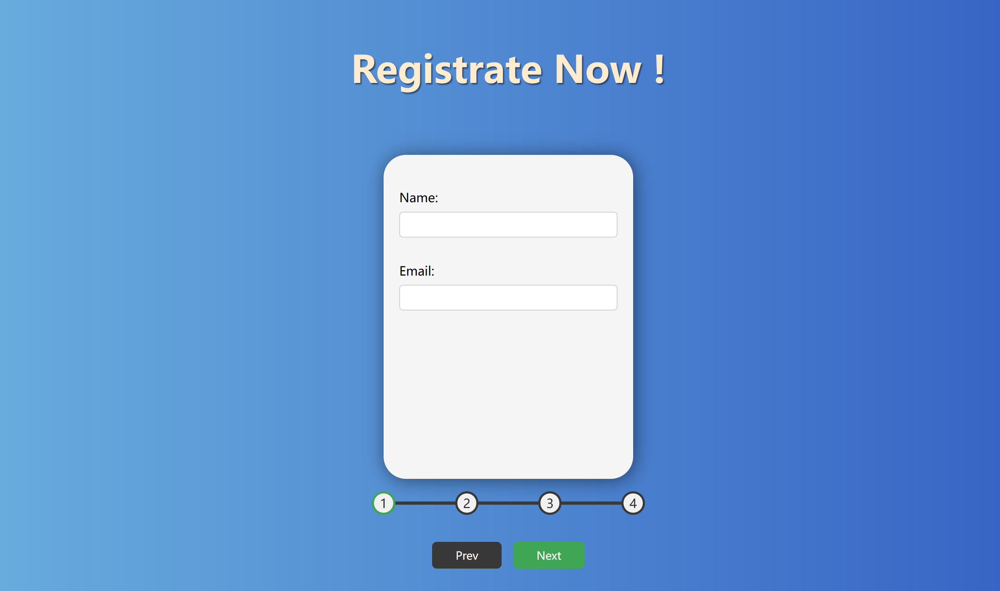
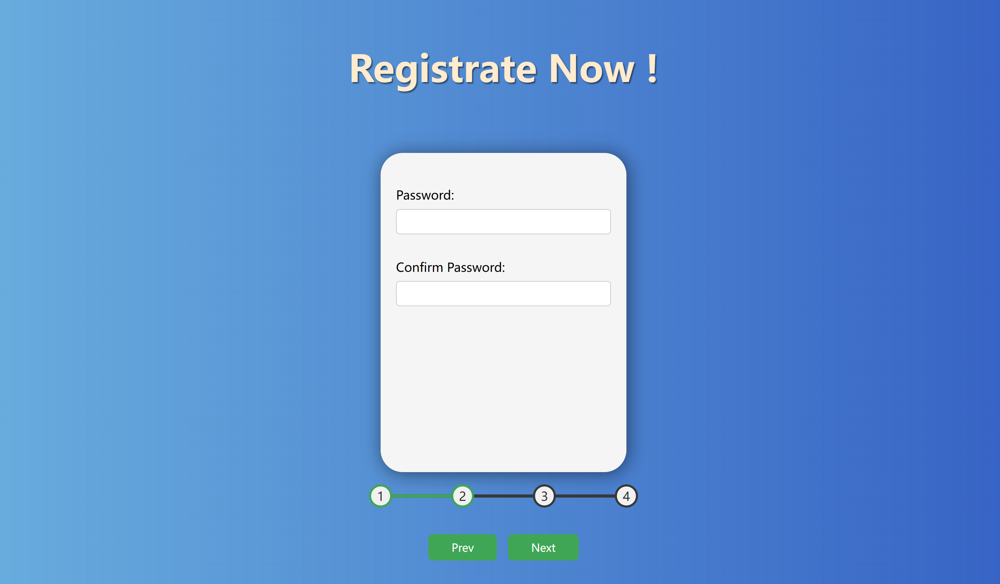
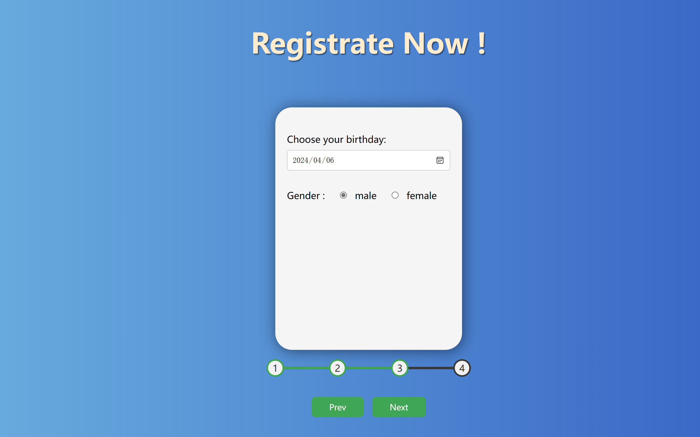
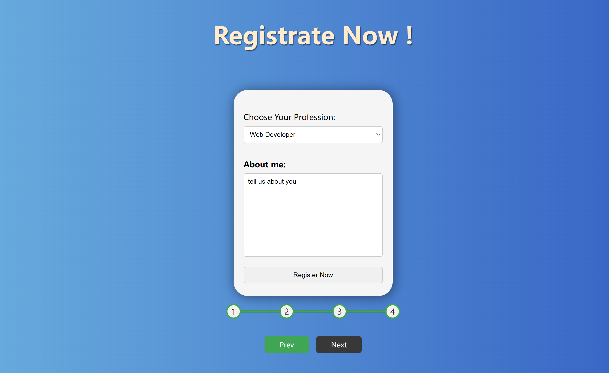

# Registration_form &#128512;
This is an registration web that collect new user's information, successful registration leads to redirecting of page.

## 1. First Step: name and email

## 2. Second Step: Password and confirmation

## 3. Thrid Step: Birthday and Gender

## 4. Fourth Step: Profession, about me and submission

